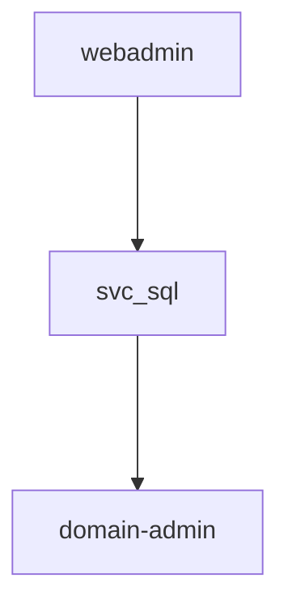

# Notes & Reports

Weaponized VSCode uses structured Markdown notes as the backbone of every engagement. You write everything in notes that the extension can parse, cross-reference, and assemble into a report.

## Foam Integration Overview

The note system builds on [Foam](https://foambubble.github.io/foam/) (`foam.foam-vscode`), a VS Code knowledge management extension. Foam provides:

- **Wiki-links** (`[[note-name]]`) -- bidirectional links between Markdown files
- **Graph visualization** -- an interactive force-directed graph of all notes and connections
- **Note templates** -- reusable templates in `.foam/templates/`

Weaponized VSCode adds on top of Foam:

- **Structured note types** -- host, user, service, finding, and report with YAML data blocks
- **CodeLens actions** -- clickable buttons above YAML and shell code blocks
- **Automated report generation** -- assembles a pentest report from the Foam graph model
- **Snippet libraries and definition providers** -- GTFOBins, LOLBAS, BloodHound, and extension-specific snippets

All notes are standard Markdown files. You can read, edit, and version-control them with any tool.

## Note Types

Five note types, each with a specific template and storage location.

### Host

Target machine. Stored at `hosts/{name}/{name}.md`.

````markdown
```yaml host
- hostname: target
  is_dc: false
  ip: 10.10.10.10
  alias: ["target"]
  is_current: false
  is_current_dc: false
  props:
    ENV_KEY: exported_in_env
```
````

**Template sections:** host location (the YAML block above), ports, information, Nmap results, vulnerabilities / exploits, related information (services, users), and proof.

### User

Compromised or discovered account. Stored at `users/{name}/{name}.md`.

````markdown
```yaml credentials
- login: corp.local
  user: esonhugh
  password: pass
  nt_hash: fffffffffffffffffffffffffffffffffff
  is_current: false
  props:
    ENV_KEY: exported_in_env
```
````

**Template sections:** validated credentials (the YAML block above), information, Privileges / roles / groups.

### Service

Network service or application. Stored at `services/{name}/{name}.md`.

**Template sections:** service alias, location, information, vulnerabilities / exploits.

### Finding

Vulnerability or security observation. Stored at `findings/{name}/{name}.md`. Unlike other types, findings use YAML **frontmatter**:

```yaml
---
title: SQL Injection in Login Form
type: finding
severity: high
tags: sqli, web, owasp
---
```

**Template sections:** description, references. See [Finding Notes](#finding-notes) for details.

### Report

Auto-generated from the Foam knowledge graph. Stored as `report.md` at the workspace root. See [Report Generation](#report-generation).

## Creating Notes

1. Open the Command Palette (`Ctrl+Shift+P` / `Cmd+Shift+P`)
2. Run **Weapon: Create/New note** and select a type (host, user, service, finding, or report)
3. Enter a name for the note

| Type | Created at |
|------|-----------|
| Host | `hosts/{name}/{name}.md` |
| User | `users/{name}/{name}.md` |
| Service | `services/{name}/{name}.md` |
| Finding | `findings/{name}/{name}.md` |
| Report | `report.md` (workspace root) |

### The user@domain Convention

Enter a name in `user@domain` format and the extension parses it automatically:

- Input: `esonhugh@corp.local`
- Result: `login` is set to `corp.local`, `user` is set to `esonhugh`

This works for any note type but is most useful for user notes where the domain/login distinction matters.

### Templates

Templates are generated by `Weapon: Setup` and stored in `.foam/templates/`. They use VS Code snippet syntax so tab stops work when Foam creates notes from them directly. When the extension creates notes via `Weapon: Create note`, it replaces placeholders with the values you provide.

::: info
You can customize the note structure by editing templates in `.foam/templates/` after running setup.
:::

## Wiki-Links and Cross-References

Wiki-links are the connective tissue of the note system. Write `[[note-name]]` in any Markdown file and Foam creates a bidirectional link.

### Basic Linking

In a host note, link to a user:

```markdown
Compromised via: [[esonhugh]]
Initial access: password spray — see [[password-spray-finding]]
```

In a user note, link to the host:

```markdown
1. Local administrator on [[target]]
2. Kerberoastable — see [[kerberoast-finding]]
```

These links build the knowledge graph used for report generation. The more you link, the richer the report.

### Tags

Frontmatter tags also create connections in the Foam graph:

```yaml
tags: kerberos, delegation, ad
```

Tags are useful for filtering findings. The MCP `list_findings` tool can filter by tags.

### CodeLens Note Creation

When you write `get user john` or `own user john` on a line, a CodeLens button appears to create a user note for "john" (if it does not already exist). The same works for hosts with `get host dc01` or `own host dc01`.

::: tip
Use this pattern as you take notes. Write "own user admin" when you compromise an account, click the CodeLens button, and the user note is one step away.
:::

## Finding Notes

Findings drive the vulnerability reporting side of the engagement.

### Structure

```markdown
---
title: SQL Injection in Login Form
type: finding
severity: high
tags: sqli, web, owasp
---

### SQL Injection in Login Form

#### description

The login form at /api/auth/login is vulnerable to SQL injection
via the `username` parameter. An unauthenticated attacker can extract
the full database including password hashes.

#### references

- https://owasp.org/www-community/attacks/SQL_Injection
- https://cve.mitre.org/cgi-bin/cvename.cgi?name=CVE-2024-XXXX
```

### Severity Levels

| Level | Use When |
|-------|----------|
| `info` | Informational observation, no direct security impact |
| `low` | Minor issue, limited exploitability or impact |
| `medium` | Moderate risk, exploitable under certain conditions |
| `high` | Serious vulnerability, directly exploitable |
| `critical` | Immediate compromise, full impact |

### Creating Findings

Three ways to create findings:

1. **Command Palette** -- `Weapon: Create note` and select **finding**
2. **MCP tool** -- `create_finding` with title, severity, tags, description, and references
3. **Manually** -- create a file in `findings/{name}/{name}.md` following the template

### MCP Integration

The MCP server exposes finding-related tools for AI assistants:

| Tool | Purpose |
|------|---------|
| `create_finding` | Create a new finding note |
| `list_findings` | List findings, filterable by severity, tags, or free-text query |
| `get_finding` | Retrieve a specific finding by ID |
| `update_finding_frontmatter` | Update severity, description, or custom properties |

::: tip
Ask your AI assistant to "show me all critical findings" or "list findings tagged with kerberos" -- the `list_findings` tool handles the filtering.
:::

## Graph Visualization

Open the Command Palette and run **Foam: Show graph** to open an interactive force-directed graph.

- **Nodes** represent notes (hosts, users, services, findings), colored by type
- **Edges** represent `[[wiki-links]]` between notes
- Click a node to open the corresponding note
- The graph updates live as you add notes and links

The graph is useful for visualizing attack paths. Follow the links from initial foothold to domain admin:

```
[target.htb] --> [webadmin] --> [svc_sql] --> [dc01] --> [domain-admin]
```

The topology of these links is exactly what the report generator uses to compute the privilege escalation path.

::: info
The graph visualization is provided by Foam. Weaponized VSCode reads the same graph model programmatically for report generation.
:::

## Code Snippets

Four snippet libraries are available when editing Markdown files. They appear in VS Code's autocomplete as you type.

- **GTFOBins** -- Unix binary exploitation techniques (privilege escalation, file read/write, shell escape). Trigger: type the binary name (`vim`, `python`, `find`, `awk`, `docker`). Inserts the full exploitation command.
- **LOLBAS** -- Windows Living Off the Land Binaries and Scripts. Trigger: type the binary name (`certutil`, `mshta`, `regsvr32`, `rundll32`).
- **BloodHound** -- Active Directory attack relationships. Trigger: type the relationship name (`GenericAll`, `WriteDacl`, `ForceChangePassword`). Inserts abuse information.
- **Weapon** -- Extension-specific snippets for common patterns and note templates.

Select a snippet from the autocomplete dropdown and press `Tab` or `Enter` to insert it.

::: warning
Snippets are only active in Markdown files. Check the language mode in the VS Code status bar if autocomplete is not showing suggestions.
:::

## Definition Provider

The extension registers hover and go-to-definition providers for BloodHound relationship terms in Markdown files.

- **Hover** over terms like `GenericAll`, `WriteDacl`, or `ForceChangePassword` to see a tooltip with the relationship description
- **Ctrl+Click** (or **Cmd+Click** on macOS) to open a virtual document with the full definition

Supported terms include `GenericAll`, `GenericWrite`, `WriteDacl`, `WriteOwner`, `ForceChangePassword`, `AddMember`, `DCSync`, and other BloodHound relationship types. This helps you understand AD attack relationships while reading notes without switching to a browser.

## Report Generation

The report generator reads the Foam knowledge graph and produces a structured Markdown report.

### Generating a Report

Run **Weapon: Create note** and select **report**. The report is saved as `report.md` at the workspace root.

::: warning
Report generation requires Foam to be active and finished indexing. Wait for Foam's status bar indicator before generating.
:::

### Report Structure

The generated report contains four sections:

**1. Hosts Information** -- each host with an embedded content reference (`![[hostname]]`) that pulls in the full host note content without duplication.

**2. Full Relations Graph** -- a Mermaid diagram of user relationship edges:

````markdown

````

**3. Privilege Escalation Path** -- the longest reference path through user-type edges, computed by `longestReferencePath()`. This represents the main escalation chain from initial access to highest privilege.

**4. Extra Pwned Users** -- any compromised users not on the main attack path.

The report frontmatter is `type: report`, which excludes it from the graph model on future report generations.

::: tip
Write your notes with wiki-links as you go. The more you link between hosts, users, and services, the richer your auto-generated report will be.
:::

## Workflow Example

A complete note-driven workflow for a typical engagement.

**1. Create host note** for `target.htb`. Set as current -- all terminals get `$TARGET`, `$RHOST`, `$IP`.

**2. Enumerate and document.** Run scans, record open ports and findings in the host note.

**3. Find credentials.** Create a user note with `Weapon: Create note` and enter `webadmin@target.htb`. The extension auto-fills `login: target.htb` and `user: webadmin`.

**4. Link notes together.** In the user note: `Found credentials on [[target]]`. In the host note: `Compromised by [[webadmin]]`.

**5. Escalate privileges.** Write `own user root` in your notes. Click the CodeLens button to create the root user note. Link: `Escalated from [[webadmin]] via sudo misconfiguration`.

**6. Record findings.** Create a finding note for each vulnerability. Set severity, tags, and description.

**7. Generate report.** Run `Weapon: Create note` and select **report**. The extension reads the graph, computes the attack path, and produces `report.md` with host details, Mermaid diagram, escalation path, and extra users.

The result is a complete, linked knowledge base:

```
workspace/
├── hosts/target/target.md              # Host details, ports, nmap
├── users/webadmin/webadmin.md          # Credentials, links to target
├── users/root/root.md                  # Escalated from webadmin
├── findings/sudo-misconfig/sudo-misconfig.md
└── report.md                           # Auto-generated report
```

Everything is Markdown in a folder. `git commit` the entire engagement for version control and auditability.

::: info
This workflow scales to large engagements with dozens of hosts and users. The graph visualization helps you track relationships, and the report generator handles assembly regardless of note count.
:::
