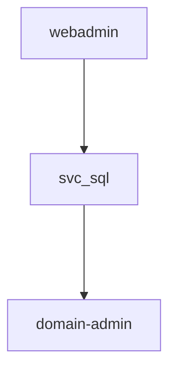

# 笔记与报告

Weaponized VSCode 使用结构化的 Markdown 笔记作为每次渗透测试的基础。你在笔记中记录一切，扩展可以对其进行解析、交叉引用，并最终组装成报告。

## Foam 集成概览

笔记系统构建于 [Foam](https://foambubble.github.io/foam/)（`foam.foam-vscode`）之上，这是一个 VS Code 知识管理扩展。Foam 提供：

- **Wiki-links**（`[[note-name]]`）—— Markdown 文件之间的双向链接
- **图形可视化** —— 所有笔记和连接的交互式力导向图
- **笔记模板** —— 存放在 `.foam/templates/` 中的可复用模板

Weaponized VSCode 在 Foam 基础上增加了：

- **结构化笔记类型** —— 主机、用户、服务、发现和报告，带有 YAML 数据块
- **CodeLens 操作** —— YAML 和 shell 代码块上方的可点击按钮
- **自动报告生成** —— 从 Foam 图模型组装渗透测试报告
- **代码片段库和定义提供程序** —— GTFOBins、LOLBAS、BloodHound 以及扩展专属代码片段

所有笔记都是标准 Markdown 文件。你可以使用任何工具阅读、编辑和进行版本控制。

## 笔记类型

五种笔记类型，每种都有特定的模板和存储位置。

### 主机

目标机器。存储于 `hosts/{name}/{name}.md`。

````markdown
```yaml host
- hostname: target
  is_dc: false
  ip: 10.10.10.10
  alias: ["target"]
  is_current: false
  is_current_dc: false
  props:
    ENV_KEY: exported_in_env
```
````

**模板章节：** 主机位置（即上方的 YAML 块）、端口、信息、Nmap 结果、漏洞/利用、相关信息（服务、用户）以及证据。

### 用户

已攻陷或发现的账户。存储于 `users/{name}/{name}.md`。

````markdown
```yaml credentials
- login: corp.local
  user: esonhugh
  password: pass
  nt_hash: fffffffffffffffffffffffffffffffffff
  is_current: false
  props:
    ENV_KEY: exported_in_env
```
````

**模板章节：** 已验证的凭据（即上方的 YAML 块）、信息、权限/角色/组。

### 服务

网络服务或应用程序。存储于 `services/{name}/{name}.md`。

**模板章节：** 服务别名、位置、信息、漏洞/利用。

### 发现

漏洞或安全观察结果。存储于 `findings/{name}/{name}.md`。与其他类型不同，发现使用 YAML **frontmatter**：

```yaml
---
title: SQL Injection in Login Form
type: finding
severity: high
tags: sqli, web, owasp
---
```

**模板章节：** 描述、参考资料。详见[发现笔记](#发现笔记)。

### 报告

从 Foam 知识图谱自动生成。以 `report.md` 形式存储在工作区根目录。详见[报告生成](#报告生成)。

## 创建笔记

1. 打开命令面板（`Ctrl+Shift+P` / `Cmd+Shift+P`）
2. 运行 **Weapon: Create/New note** 并选择类型（host、user、service、finding 或 report）
3. 输入笔记名称

| 类型 | 创建位置 |
|------|----------|
| Host | `hosts/{name}/{name}.md` |
| User | `users/{name}/{name}.md` |
| Service | `services/{name}/{name}.md` |
| Finding | `findings/{name}/{name}.md` |
| Report | `report.md`（工作区根目录） |

### user@domain 命名约定

以 `user@domain` 格式输入名称，扩展会自动解析：

- 输入：`esonhugh@corp.local`
- 结果：`login` 设为 `corp.local`，`user` 设为 `esonhugh`

此功能适用于任何笔记类型，但对于需要区分域/登录名的用户笔记最为实用。

### 模板

模板由 `Weapon: Setup` 生成并存储在 `.foam/templates/` 中。模板使用 VS Code 代码片段语法，因此当 Foam 直接从模板创建笔记时，Tab 停靠点可正常工作。当扩展通过 `Weapon: Create note` 创建笔记时，会用你提供的值替换占位符。

::: info
你可以在运行 setup 后编辑 `.foam/templates/` 中的模板来自定义笔记结构。
:::

## Wiki-Links 和交叉引用

Wiki-links 是笔记系统的连接纽带。在任何 Markdown 文件中写入 `[[note-name]]`，Foam 就会创建双向链接。

### 基本链接

在主机笔记中链接到用户：

```markdown
Compromised via: [[esonhugh]]
Initial access: password spray — see [[password-spray-finding]]
```

在用户笔记中链接到主机：

```markdown
1. Local administrator on [[target]]
2. Kerberoastable — see [[kerberoast-finding]]
```

这些链接构建了用于报告生成的知识图谱。链接越多，报告内容越丰富。

### 标签

Frontmatter 标签同样会在 Foam 图中创建连接：

```yaml
tags: kerberos, delegation, ad
```

标签可用于过滤发现。MCP `list_findings` 工具支持按标签过滤。

### CodeLens 笔记创建

当你在某行写下 `get user john` 或 `own user john` 时，会出现一个 CodeLens 按钮来为 "john" 创建用户笔记（如果尚不存在）。主机同理，使用 `get host dc01` 或 `own host dc01`。

::: tip
在记笔记时使用此模式。当你攻陷一个账户时写下 "own user admin"，点击 CodeLens 按钮，用户笔记即刻创建。
:::

## 发现笔记

发现驱动着渗透测试中的漏洞报告部分。

### 结构

```markdown
---
title: SQL Injection in Login Form
type: finding
severity: high
tags: sqli, web, owasp
---

### SQL Injection in Login Form

#### description

The login form at /api/auth/login is vulnerable to SQL injection
via the `username` parameter. An unauthenticated attacker can extract
the full database including password hashes.

#### references

- https://owasp.org/www-community/attacks/SQL_Injection
- https://cve.mitre.org/cgi-bin/cvename.cgi?name=CVE-2024-XXXX
```

### 严重等级

| 等级 | 使用场景 |
|------|----------|
| `info` | 信息性观察，无直接安全影响 |
| `low` | 轻微问题，可利用性或影响有限 |
| `medium` | 中等风险，在特定条件下可被利用 |
| `high` | 严重漏洞，可直接利用 |
| `critical` | 可立即导致系统沦陷，影响最大 |

### 创建发现

三种创建发现的方式：

1. **命令面板** —— `Weapon: Create note` 并选择 **finding**
2. **MCP 工具** —— 使用 `create_finding`，提供标题、严重等级、标签、描述和参考资料
3. **手动创建** —— 在 `findings/{name}/{name}.md` 中按模板创建文件

### MCP 集成

MCP 服务器为 AI 助手提供了与发现相关的工具：

| 工具 | 用途 |
|------|------|
| `create_finding` | 创建新的发现笔记 |
| `list_findings` | 列出发现，可按严重等级、标签或自由文本查询过滤 |
| `get_finding` | 按 ID 检索特定发现 |
| `update_finding_frontmatter` | 更新严重等级、描述或自定义属性 |

::: tip
让你的 AI 助手 "显示所有 critical 级别的发现" 或 "列出标记为 kerberos 的发现" —— `list_findings` 工具会处理过滤。
:::

## 图形可视化

打开命令面板并运行 **Foam: Show graph** 以打开交互式力导向图。

- **节点** 代表笔记（主机、用户、服务、发现），按类型着色
- **边** 代表笔记之间的 `[[wiki-links]]`
- 点击节点即可打开对应笔记
- 图形会在你添加笔记和链接时实时更新

该图形可用于可视化攻击路径。沿链接从初始立足点追踪到域管理员：

```
[target.htb] --> [webadmin] --> [svc_sql] --> [dc01] --> [domain-admin]
```

这些链接的拓扑结构正是报告生成器用来计算权限提升路径的依据。

::: info
图形可视化由 Foam 提供。Weaponized VSCode 以编程方式读取相同的图模型来生成报告。
:::

## 代码片段

编辑 Markdown 文件时有四个代码片段库可用。它们会在你输入时出现在 VS Code 的自动补全中。

- **GTFOBins** —— Unix 二进制文件利用技术（权限提升、文件读写、shell 逃逸）。触发方式：输入二进制文件名（`vim`、`python`、`find`、`awk`、`docker`）。将插入完整的利用命令。
- **LOLBAS** —— Windows 就地取材二进制文件和脚本。触发方式：输入二进制文件名（`certutil`、`mshta`、`regsvr32`、`rundll32`）。
- **BloodHound** —— Active Directory 攻击关系。触发方式：输入关系名称（`GenericAll`、`WriteDacl`、`ForceChangePassword`）。将插入滥用信息。
- **Weapon** —— 扩展专属代码片段，包含常用模式和笔记模板。

从自动补全下拉列表中选择代码片段，按 `Tab` 或 `Enter` 插入。

::: warning
代码片段仅在 Markdown 文件中有效。如果自动补全未显示建议，请检查 VS Code 状态栏中的语言模式。
:::

## 定义提供程序

扩展为 Markdown 文件中的 BloodHound 关系术语注册了悬停和转到定义提供程序。

- **悬停** `GenericAll`、`WriteDacl` 或 `ForceChangePassword` 等术语，可查看包含关系描述的工具提示
- **Ctrl+Click**（macOS 上为 **Cmd+Click**）可打开包含完整定义的虚拟文档

支持的术语包括 `GenericAll`、`GenericWrite`、`WriteDacl`、`WriteOwner`、`ForceChangePassword`、`AddMember`、`DCSync` 以及其他 BloodHound 关系类型。这可以帮助你在阅读笔记时理解 AD 攻击关系，无需切换到浏览器。

## 报告生成

报告生成器读取 Foam 知识图谱并生成结构化的 Markdown 报告。

### 生成报告

运行 **Weapon: Create note** 并选择 **report**。报告将以 `report.md` 保存在工作区根目录。

::: warning
报告生成需要 Foam 处于活跃状态并完成索引。请在生成前等待 Foam 状态栏指示器就绪。
:::

### 报告结构

生成的报告包含四个部分：

**1. 主机信息** —— 每个主机带有嵌入式内容引用（`![[hostname]]`），可直接拉取完整主机笔记内容，避免重复。

**2. 完整关系图** —— 用户关系边的 Mermaid 图表：

````markdown

````

**3. 权限提升路径** —— 通过用户类型边计算的最长引用路径，由 `longestReferencePath()` 计算。这代表了从初始访问到最高权限的主要提权链。

**4. 额外已攻陷用户** —— 不在主攻击路径上的其他已攻陷用户。

报告的 frontmatter 为 `type: report`，这会使其在后续报告生成时被排除在图模型之外。

::: tip
在工作过程中使用 wiki-links 记录笔记。主机、用户和服务之间的链接越多，自动生成的报告就越丰富。
:::

## 工作流示例

一个典型渗透测试的完整笔记驱动工作流。

**1. 创建主机笔记** —— 为 `target.htb` 创建。设为当前主机 —— 所有终端将获得 `$TARGET`、`$RHOST`、`$IP` 环境变量。

**2. 枚举并记录。** 运行扫描，在主机笔记中记录开放端口和发现。

**3. 发现凭据。** 使用 `Weapon: Create note` 创建用户笔记，输入 `webadmin@target.htb`。扩展自动填充 `login: target.htb` 和 `user: webadmin`。

**4. 链接笔记。** 在用户笔记中：`Found credentials on [[target]]`。在主机笔记中：`Compromised by [[webadmin]]`。

**5. 提升权限。** 在笔记中写入 `own user root`。点击 CodeLens 按钮创建 root 用户笔记。添加链接：`Escalated from [[webadmin]] via sudo misconfiguration`。

**6. 记录发现。** 为每个漏洞创建发现笔记。设置严重等级、标签和描述。

**7. 生成报告。** 运行 `Weapon: Create note` 并选择 **report**。扩展读取图谱、计算攻击路径，生成包含主机详情、Mermaid 图表、提权路径和额外用户的 `report.md`。

最终结果是一个完整的、互相链接的知识库：

```
workspace/
├── hosts/target/target.md              # 主机详情、端口、nmap
├── users/webadmin/webadmin.md          # 凭据、链接到 target
├── users/root/root.md                  # 从 webadmin 提权
├── findings/sudo-misconfig/sudo-misconfig.md
└── report.md                           # 自动生成的报告
```

一切都是文件夹中的 Markdown。使用 `git commit` 提交整个渗透测试项目，实现版本控制和可审计性。

::: info
此工作流可扩展到拥有数十台主机和用户的大型渗透测试。图形可视化帮助你追踪关系，报告生成器无论笔记数量多少都能处理组装工作。
:::
